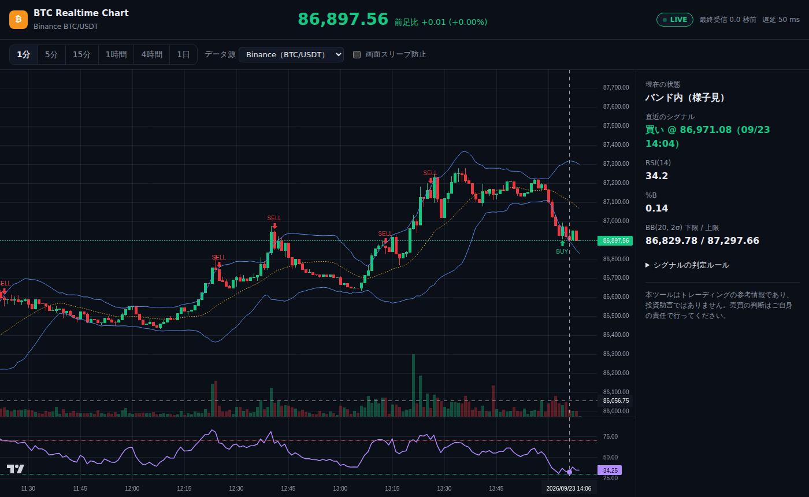

# BTC Realtime Chart

[](https://btc-realtime-chart.kinamocchi-tech.workers.dev)
[](https://github.com/kai-kou/tsukuru)

BTC の価格変動をリアルタイムに確認できる、トレーディング参考用の Web アプリ。

**▶ アプリ: https://btc-realtime-chart.kinamocchi-tech.workers.dev**（ブラウザで開くだけで使える。登録・インストール不要）

[](https://btc-realtime-chart.kinamocchi-tech.workers.dev)

> 本ツールはトレーディングの参考情報であり、投資助言ではありません。

## tsukuru をベースに作成

このリポジトリは、アイデアからリリースまでを Claude Code で自律的に進める開発基盤
**tsukuru**（開発母艦 `kai-kou/tsukuru-studio` の公開テンプレート [kai-kou/tsukuru](https://github.com/kai-kou/tsukuru)）を
土台にして作った。空のリポジトリに `apply-to-repo.sh --base kai-kou/tsukuru` を適用し、tsukuru の上流工程
（要件定義・技術選定）→ 実装 → レビュー → Cloudflare へのデプロイ、の流れで公開まで進めている。

- ルール・スキル・ハーネス（`CLAUDE.md` / `.claude/` / `docs/rules/` / `tools/`）は tsukuru から配布されたもの
- アプリ本体（`src/` / `public/` / `test/` / `e2e/`）と要件ドキュメント（`docs/product-brief.md` 等）がこのプロジェクト固有のもの
- 公開までの経緯と、作成したドキュメントの一覧: [docs/development-history.md](docs/development-history.md)

## できること

- ローソク足 + ボリンジャーバンド（20, 2σ）+ 出来高 + RSI(14)
- 確定足で判定する売買シグナル（BUY / SELL マーカー）。判定ルールは画面の「シグナルの判定ルール」と `docs/product-brief.md` `D-6`
- 取引所の WebSocket に直接接続し、約定ごとに形成中の足を更新する（Binance 市場データ専用エンドポイント。使えないときは Coinbase へ自動で切り替える）
- 最新の足への自動追従・「最新へ」ボタン・自動再接続（無通信監視つき）・タブ復帰時の欠損足の取り直し・画面スリープ防止
- 時間足: 1 分・5 分・15 分・1 時間・4 時間・1 日

## 開発

```bash
npm ci
npm test          # ドメイン層・再接続・フェイルオーバーのユニットテスト（node:test）
npm run build     # dist/ に静的アセットを生成（esbuild）
npm run deploy    # Cloudflare Workers へデプロイ（CLOUDFLARE_API_TOKEN / CLOUDFLARE_ACCOUNT_ID が必要）
node e2e/smoke.mjs https://btc-realtime-chart.kinamocchi-tech.workers.dev/   # 受け入れ基準の E2E 確認（Playwright）
```

## ドキュメント

| ドキュメント | 内容 |
|---|---|
| [docs/development-history.md](docs/development-history.md) | 公開までの経緯（時系列）と、作成したドキュメントの案内 |
| [docs/product-brief.md](docs/product-brief.md) | 要件（課題・機能要件・受け入れ基準・技術選定の決定ログ・未決事項） |
| [docs/architecture.md](docs/architecture.md) | 層構造・依存規則・モジュールの責務・用語 |
| [content/research/btc-realtime-chart_deep_research.md](content/research/btc-realtime-chart_deep_research.md) | データ源（取引所 API）の調査結果 |
