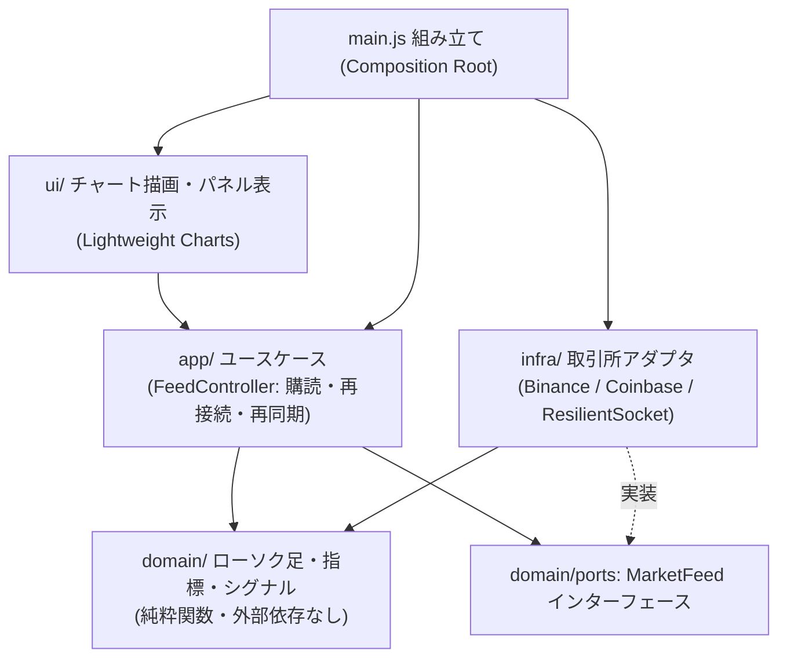

# アーキテクチャ / ドメインモデル定義: BTC Realtime Chart

> `docs/product-brief.md` §5.1 `D-4`（ブラウザから取引所へ直接接続）と §5.0（クリーンアーキテクチャ・DDD・TDD）を受けた定義。

## 1. 層構造

配信は Cloudflare Workers の静的アセット（`D-1`）。サーバー側の処理は持たない。

## 2. 依存規則

| 層 | 依存してよい先 | 依存してはいけない先 |
|---|---|---|
| `domain/` | なし（標準の JavaScript のみ） | DOM・WebSocket・fetch・チャートライブラリ |
| `app/` | `domain/`（ポートとして定義された `MarketFeed` の形に依存） | 具体的な取引所アダプタ・チャートライブラリ |
| `infra/` | `domain/`（`candles.js` / `intervals.js`） | `ui/`・`app/` |
| `ui/` | `domain/`（表示用の型・`currentBias`） | `infra/` |
| `main.js` | すべて（組み立て専用） | — |

`domain/` は Node.js の `node:test` でそのままテストする（ブラウザ不要・TDD の対象）。

## 3. モジュール分割（責務）

| モジュール | 責務 | 担う要件 |
|---|---|---|
| `domain/intervals.js` | 時間足の定義・足の区切り時刻の計算 | `FR-4` |
| `domain/candles.js` | 約定の足への反映・確定足の上書き・足の合成（1 時間足 → 4 時間足） | `FR-1` / `D-3` |
| `domain/indicators.js` | ボリンジャーバンド・RSI・%B | `FR-2` / `FR-7` |
| `domain/signals.js` | 売買シグナル判定（確定足のみ）・形成中の足の状態表示 | `FR-3` / `FR-7` |
| `infra/resilientSocket.js` | WebSocket の自動再接続（指数バックオフ + ジッター）・無通信の検知 | `FR-6` |
| `infra/binanceFeed.js` / `infra/coinbaseFeed.js` | 過去足の取得と、リアルタイム配信の購読（取引所ごとの形式を `domain/` の形へ変換） | `FR-1` / `NFR-1` / `NFR-3` |
| `app/feedController.js` | データ源の選択・フェイルオーバー・タブ復帰やオンライン復帰時の再同期 | `FR-6` / `NFR-3` |
| `ui/chartView.js` | ローソク足・バンド・出来高・RSI・マーカーの描画、最新への自動追従と「最新へ」ボタン | `FR-1`〜`FR-5` |
| `ui/panelView.js` | 現在値・前足比・%B・RSI・状態・接続状態の表示 | `FR-6` / `FR-7` |

## 4. ユビキタス言語（最小限）

| 用語 | 意味 | 使わない別名 |
|---|---|---|
| 足（candle） | 1 つの時間足区間の始値・高値・安値・終値・出来高 | バー・ローソク（単独で使わない） |
| 確定足 | 区間が終わり、値が変わらなくなった足 | 完成足 |
| 形成中の足 | 現在の区間で、約定のたびに更新される足 | 未確定足・最新足 |
| 約定（trade） | 取引所で成立した 1 件の売買（価格・数量・時刻） | ティック |
| シグナル | 確定足で判定した買い / 売りの目安 | サイン・アラート |
| データ源（feed） | 過去足の取得とリアルタイム配信をまとめた取引所ごとの接続 | ソース・プロバイダ |
