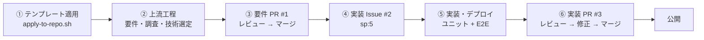

# 公開までの経緯と作成したドキュメント

BTC Realtime Chart を「依頼 → 要件定義 → 実装 → 公開」まで進めた記録。
tsukuru（開発母艦 `kai-kou/tsukuru-studio` の公開テンプレート `kai-kou/tsukuru`）を使って、
第三者と同じ導入手順で 1 本のプロダクトを完走できるかの検証を兼ねている。

- アプリ: https://btc-realtime-chart.kinamocchi-tech.workers.dev
- 期間: 2026-09-23 13:20 JST 〜 14:09 JST（1 セッション・アプリ公開まで。本書と README の整備は 14:20 JST ごろ）

## 1. 依頼内容

> BTCの価格変動についてリアルタイムに確認できるwebアプリを作ってください。
>
> - インフラはCloudflare
> - 公開されているAPIからよりリアルタイムに取得できるものを採用する
> - WebSocketが利用できるとより良い
> - チャートはローソク足
> - ボリンジャーバンドなどを描画して買い時、売り時を描画する
> - 本アプリの目的はトレーディングの参考になること
> - 最新のチャートが常に表示されるように工夫する

依頼の途中で「公開テンプレートを利用する前提」と補足があり、開発母艦の中ではなく、テンプレートから作った
新しいリポジトリで進める方針に切り替えた。

## 2. 全体の流れ

| # | 時刻（JST・目安） | 工程 | 何をしたか | 成果物 |
|---|---|---|---|---|
| ① | 13:25〜13:44 | テンプレート適用 | 空のリポジトリに `apply-to-repo.sh --base kai-kou/tsukuru` を適用（257 ファイル）。初回コミットだけ main へ直接入れ、以降はすべて PR 経由 | ルール・スキル・ハーネス一式 |
| ② | 13:30〜13:50 | 上流工程（`upstream-flow`） | 依頼を要件へ落とし、取引所 API を実接続で調べてデータ源を決めた。Tier 1 判定で「アーキテクチャ定義書を作るか」を確認し、作ると決めた | `docs/product-brief.md` / `docs/architecture.md` / 調査結果 |
| ③ | 13:50〜14:01 | 要件 PR | フレッシュ文脈のレビューで 4 件の指摘（うち 3 件採用）。受け入れ基準に AC-6 / AC-7 を追加 | [PR #1](https://github.com/kai-kou/btc-realtime-chart/pull/1) |
| ④ | 14:01 | 実装 Issue | 要件と決定ログを転記して `sp:5` で起票 | [Issue #2](https://github.com/kai-kou/btc-realtime-chart/issues/2) |
| ⑤ | 13:30〜14:08 | 実装・デプロイ | テスト先行でドメイン層を作り、取引所との接続・画面を実装。Cloudflare Workers にデプロイして、本番 URL に対して E2E を実行。ドメイン層は方針の切り替え前に母艦で書き始めていたため、①〜③と並行して進み、このリポジトリへは移したうえで 13:59 にコミットした | `src/` / `test/` / `e2e/` |
| ⑥ | 14:01〜14:09 | 実装 PR | 観点別の 2 系統レビュー（正しさ・堅牢性 / セキュリティ・性能）の指摘 7 件と、E2E で見つけた不具合 1 件に対応 | [PR #3](https://github.com/kai-kou/btc-realtime-chart/pull/3) |

## 3. 主な判断

決定の全件と理由は [product-brief.md §5.1 決定ログ](product-brief.md) にある。ここでは要点だけ示す。

| 論点 | 決めたこと | 理由・トレードオフ |
|---|---|---|
| データ源 | Binance の市場データ専用エンドポイント（約定ストリーム + ローソク足ストリーム） | 約定ごとに届くので最もリアルタイム。通常の Binance API は地域制限（451）があるため、制限のない市場データ専用のものを選んだ |
| 障害時 | Coinbase Exchange へ自動で切り替え | 地域制限・障害でも表示を続けるため。Coinbase は 4 時間足が無いので 1 時間足から組み立てる |
| 接続方式 | ブラウザから取引所へ直接 WebSocket 接続。Cloudflare は静的配信のみ | 中継を挟まないので遅延が最小（実測 50〜60ms）で、費用もかからない。利用者が増えて取引所の接続上限が問題になったら、Durable Objects で 1 本の接続を配り直す構成へ移せる |
| 売買シグナル | バンドの外で引けた足の次がバンド内に戻り、RSI が 35 以下（買い）/ 65 以上（売り） | バンドにふれただけで出すと強いトレンドで連発するため、反転と過熱感を条件にした。確定した足だけで判定するので、一度出たシグナルは消えない |
| 最新表示 | 最新足への自動追従、「最新へ」ボタン、無通信監視つき自動再接続、タブ復帰時の取り直し、接続状態の常時表示 | 「常に最新が見えている」ことを、表示・接続・復帰の 3 方向から担保するため |

## 4. 検証で見つけて直した不具合

| 見つけた経路 | 不具合 | 直し方 |
|---|---|---|
| E2E（強制切断テスト） | 切断処理が終わらずに止まったソケットを、無通信監視が再接続しなかった | 接続状態に関係なく、無通信が続いたら作り直す |
| E2E（「最新へ」ボタン） | 時間足を切り替えるたびに過去足を余分に取り直し、そのたびに最新位置へ強制的に戻していた | 切り替え時の初回接続は取り直さない。取り直しても表示位置は保つ |
| コードレビュー | 複数本の足をまたぐ受信のまとまり（タブ復帰時など）で、途中の足がチャートから抜ける | 描いていない足が 2 本以上あれば全体を描き直す |
| コードレビュー | 全データ源が落ちていると、0.5 秒間隔で再試行し続ける | 指数バックオフ（上限 30 秒）にした |
| コードレビュー | 出来高を約定とローソク足の両方から足し、一時的に二重に数える | 出来高はローソク足ストリームだけを正とした |

受け入れ基準（`product-brief.md` §4 の AC-1〜AC-7）は、ユニットテスト 25 件と、本番 URL に対する E2E 11 項目で確認した。

## 5. 作成したドキュメント

| ドキュメント | 役割 | いつ読むか |
|---|---|---|
| [README.md](../README.md) | アプリへの入口、できること、開発コマンド | 最初に |
| [docs/product-brief.md](product-brief.md) | 要件の正本。課題・想定利用者・機能要件（FR）・非機能要件（NFR）・受け入れ基準（AC）・技術選定の決定ログ（D）・未決事項（Q） | 仕様を変える・追加するとき |
| [docs/architecture.md](architecture.md) | 層構造（domain / app / infra / ui）と依存してよい向き、モジュールの責務、用語の統一 | コードを読む・直すとき |
| [content/research/btc-realtime-chart_deep_research.md](../content/research/btc-realtime-chart_deep_research.md) | 取引所 API の比較と実接続の結果（出典つき） | データ源を見直すとき |
| docs/development-history.md（本書） | 公開までの経緯と判断の要約 | 経緯を知りたいとき |

tsukuru の方針により、既定で作る要件ドキュメントは 1 本だけにしている。`architecture.md` は Tier 1 判定
（決定ログに「アーキテクチャ」の記録があった）を受けて、確認のうえ追加した。

## 6. tsukuru（テンプレート）側へのフィードバック

実プロダクトで最後まで通したことで、テンプレート側の不具合が 2 件見つかった。開発母艦に起票済み。

- 推奨の導入手順（`apply-to-repo.sh`）では、要件ドキュメントの雛形と Tier 1 判定用のタグ語彙ファイルが届かず、上流工程が途中で止まる（今回は手でコピーして回避）
- 開発母艦のセッションから下流リポジトリへ PR を出すと、PR 前チェックのフックが母艦側のコミットを見て誤ってブロックする

## 7. 残っている未決事項

`product-brief.md` §6 より。

- `Q-1`: 円建て（BTC/JPY）表示が必要か
- `Q-2`: シグナルの閾値を画面で調整できるようにするか
- `Q-3`: 公開範囲（誰でも見られる状態のままか、Cloudflare Access で制限するか）
